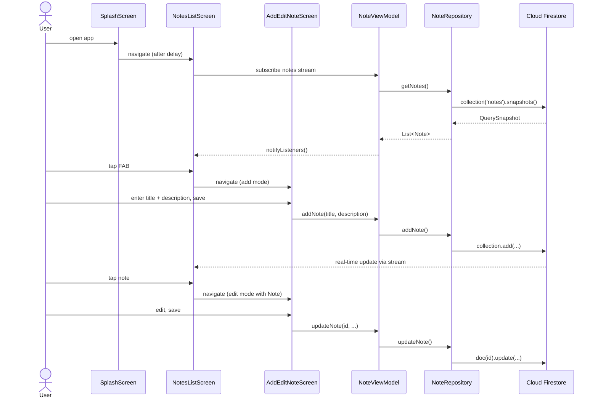

## Plan: Notes App Completion

**TL;DR** — Firebase + Firestore CRUD layer (`DatabaseService`) is already done and Firebase is initialized in `main.dart`. The 14 placeholder files across `core/`, `models/`, `repositories/`, `viewmodels/`, `views/`, `utils/`, and `routes` need to be filled in bottom-up (constants → model → repository → viewmodel → screens → routes → `main.dart`) so the notes app can run end-to-end. Replace the counter demo in `main.dart` last.

---

**Steps**

1. **(Step 1 — Foundation) Fill the constant/theme/route skeleton.** Populate `lib/core/constants/firestore_constants.dart` with the `'notes'` collection name, `app_colors.dart`, `app_dimensions.dart`, `app_strings.dart`, `app_theme.dart`, and `app_routes.dart` (route names like `splash`, `notesList`, `addEdit`). (depends on none)
2. **(Step 2 — Build reusable widgets first.)** Implement `core/widgets/custom_button.dart`, `custom_text_field.dart`, `loading_widget.dart`, `empty_notes_widget.dart`, `note_card.dart` (accepts a `Note`, shows title + description snippet + edit/delete callbacks). These are pure stateless widgets with no Firestore dependency. (parallel with Step 3)
3. **(Step 3 — Data layer.)** Implement `lib/models/note_model.dart` with fields `id`, `title`, `description`, `createdAt`, plus `fromMap`/`toMap`/`fromFirestore`. Then implement `lib/repositories/note_repository.dart` as a thin wrapper around the existing `DatabaseService` returning `Stream<List<Note>>` and typed methods. (depends on Step 1; parallel with Step 2)
4. **(Step 4 — Validation + ViewModel.)** Implement `lib/utils/validators.dart` (`validateTitle`, `validateDescription`). Implement `lib/viewmodels/note_viewmodel.dart` using `ChangeNotifier` — holds `notes` stream subscription, exposes `add`, `update`, `delete`, `loading`, and `errorMessage`. (depends on Steps 2 and 3)
5. **(Step 5 — Splash screen.)** Implement `lib/views/splash/splash_screen.dart` — show the `LoadingWidget` for ~1.5 s, then `Navigator.pushReplacementNamed(AppRoutes.notesList)`. (depends on Step 1)
6. **(Step 6 — Notes List screen.)** Implement `lib/views/notes/notes_list_screen.dart` — `Consumer`/`Provider` on `NoteViewModel`, render `StreamBuilder` of notes, show `EmptyNotesWidget` when empty, otherwise `ListView` of `NoteCard`, with a `FloatingActionButton` navigating to add screen. Tap card → edit. (depends on Steps 2, 4, 5)
7. **(Step 7 — Add/Edit Note screen.)** Implement `lib/views/notes/add_edit_note_screen.dart` — accepts an optional `Note`, two `CustomTextField`s (title + description), validates with `Validators`, Save calls `NoteViewModel.addNote` or `updateNote`. (depends on Steps 4 and 6)
8. **(Step 8 — Wire main.dart.)** Strip the counter UI from `lib/main.dart`, wrap `MyApp` in `MultiProvider` exposing `NoteViewModel`, set theme from `AppTheme`, register `onGenerateRoute` using `AppRoutes`, and use `AppRoutes.splash` as `initialRoute`. (depends on Steps 1–7)
9. **(Step 9 — Provider dependency.)** Run `flutter pub add provider` (your `pubspec.yaml` doesn't have it yet — required for `ChangeNotifier` consumption) and `flutter pub get`. (depends on Step 8)
10. **(Step 10 — Verify build/run.)** Run `flutter analyze` then `flutter run -d <device>`. Smoke test: open app → splash → list (empty state) → add note → see it in list → tap to edit → save → swipe/long-press delete → confirm it disappears. (depends on Step 9)

---

**Relevant files**

- `lib/main.dart` — REPLACE counter UI with `MultiProvider` + `MaterialApp(theme: AppTheme.light, initialRoute: AppRoutes.splash, onGenerateRoute: ...)`.
- `lib/firebase_options.dart` — already generated by FlutterFire CLI; no change.
- `lib/models/note_model.dart` — CREATE `Note` class with `id`, `title`, `description`, `createdAt`, `fromFirestore`, `toMap`, `copyWith`.
- `lib/repositories/note_repository.dart` — CREATE wrapper over the existing `DatabaseService` returning `Stream<List<Note>>`.
- `lib/services/firestore_service.dart` — KEEP as-is. It already has `addNote`, `getNotes`, `updateNote`, `deleteNote`.
- `lib/viewmodels/note_viewmodel.dart` — CREATE `ChangeNotifier` exposing `notes` (stream), `addNote`, `updateNote`, `deleteNote`, plus `isLoading`/`errorMessage`.
- `lib/utils/validators.dart` — CREATE `validateTitle`, `validateDescription` returning `String?` error.
- `lib/views/splash/splash_screen.dart` — CREATE timed splash then navigate to notes list.
- `lib/views/notes/notes_list_screen.dart` — CREATE list UI with FAB + empty/loading states.
- `lib/views/notes/add_edit_note_screen.dart` — CREATE form screen with validation, dual-mode add/edit.
- `lib/core/constants/app_routes.dart` — CREATE route name constants; also fill `app_strings.dart`, `app_colors.dart`, `app_dimensions.dart`, `firestore_constants.dart`.
- `lib/core/theme/app_theme.dart` — CREATE `ThemeData` factory (used by `main.dart`).
- `lib/core/widgets/custom_button.dart`, `custom_text_field.dart`, `loading_widget.dart`, `empty_notes_widget.dart`, `note_card.dart` — CREATE presentational widgets used by both screens.
- `pubspec.yaml` — ADD `provider: ^6.x.x` to dependencies.

---

**Diagrams**

```mermaid
flowchart TD
    UI[Screens: splash / notes_list / add_edit] --> VM[NoteViewModel\nChangeNotifier]
    VM --> Repo[NoteRepository]
    Repo --> Svc[DatabaseService\n(Firestore CRUD)]
    Svc --> FS[(Cloud Firestore\ncollection: notes)]
    Widgets[Reusable widgets:\nNoteCard, CustomTextField,\nCustomButton, LoadingWidget,\nEmptyNotesWidget] --> UI
    Validators[utils/validators.dart] --> UI
    Routes[core/routes/app_routes.dart] --> UI
    Theme[core/theme/app_theme.dart] --> UI
```



---

**Verification**

1. `flutter analyze` — no errors/warnings.
2. `flutter pub get` succeeds after `provider` is added.
3. App launches → splash ~1.5 s → notes list.
4. Empty state visible on first run.
5. Add note → appears in list without manual refresh (stream-driven).
6. Tap card → edit screen pre-filled → save → list updates.
7. Delete (icon on card / dialog) → note disappears from list.
8. Invalid form (empty title) → inline error shown, Save blocked.
9. Firebase Console → `notes` collection shows the documents you created.
